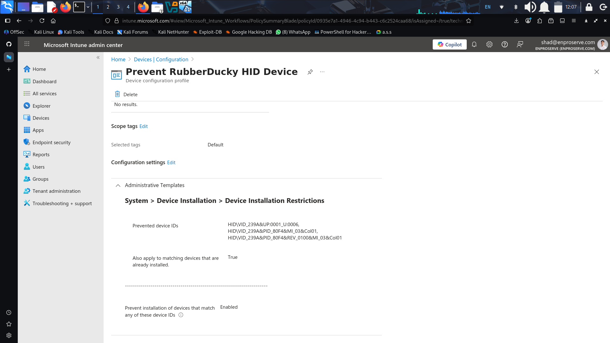
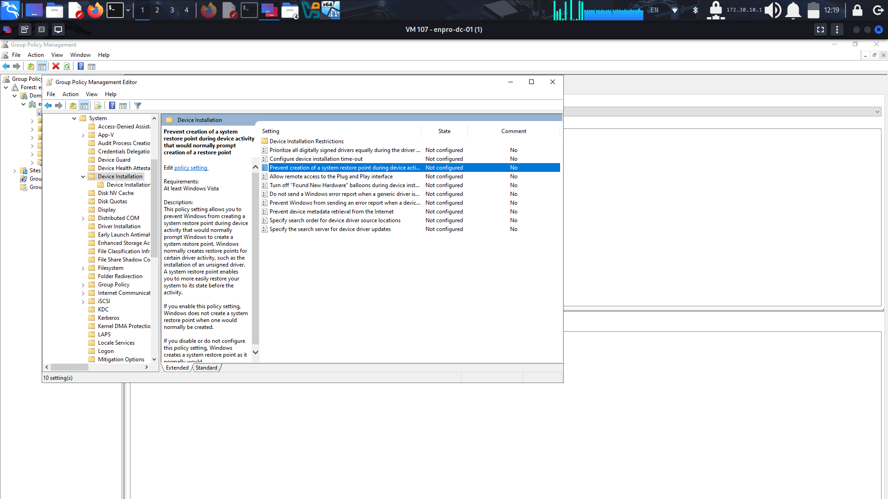
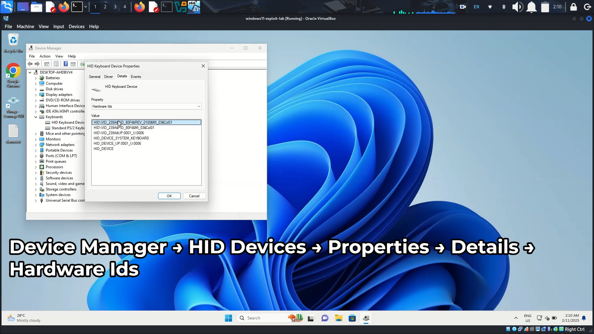

# 🛡️ BadUSB Mitigation Guide
**Objective:** Prevent or disrupt HID (Human Interface Device) keystroke injection attacks and limit payload execution.

## 🎯 Goal
Mitigate the risk of **BadUSB** devices (such as Rubber Ducky) that emulate keyboards to inject unauthorized commands.

## 🧩 1. Set a Local Administrator Password
**Purpose:**  
A strong and unique local admin password helps disrupt keystroke injection attacks that attempt privilege escalation or administrative command execution.

**Recommended Actions:**
- Ensure **local administrator account** is enabled but **secured with a unique, complex password**.
- Avoid using the same local admin password across multiple machines (use LAPS or Intune Local Administrator Password Solution).
- Disable unnecessary administrator accounts where possible.

This step prevents injected keystrokes from running elevated commands.

## ⚙️ 2. Use Configuration Tools (GPO or Intune)
**Purpose:**  
Prevent unknown USB HID devices from being installed or recognized by the operating system.

### 📘 Microsoft Intune
If you have physical access to the device or manage it via Intune:

**Path:**  
`Devices > Configuration profiles > Windows 10 and later > Settings catalog > System > Device Installation > Device Installation Restrictions`

**Configuration:**
- **Prevent installation of devices that match any of these device IDs**
  - Add your BadUSB device’s hardware ID. Example:
    ```
    USB\VID_2E8A&PID_000A
    ```
**Screenshot Example:**  


### 🧱 Windows Group Policy (GPO)
For domain-joined or standalone Windows devices:

**Path:**  
`Computer Configuration > Administrative Templates > System > Device Installation > Device Installation Restrictions`

**Enable the following:**
1. **Prevent installation of devices that match any of these device IDs**  
   Add:
**Screenshot Example:**  


**How to Get Device ID:**
1. Plug in the suspected USB device.  
2. Open **Device Manager**.  
3. Expand **Human Interface Devices (HID)**.  
4. Right-click the target device → **Properties**.  
5. Under the **Details** tab → select **Property: Hardware Ids**.  
6. Copy the line containing `VID_XXXX&PID_YYYY`.

**Screenshot Example:**  

