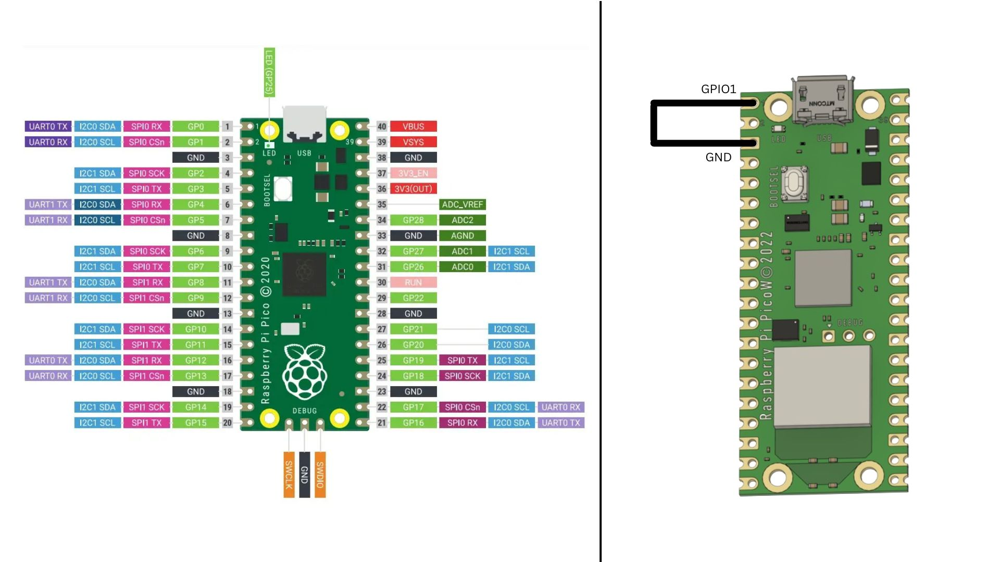
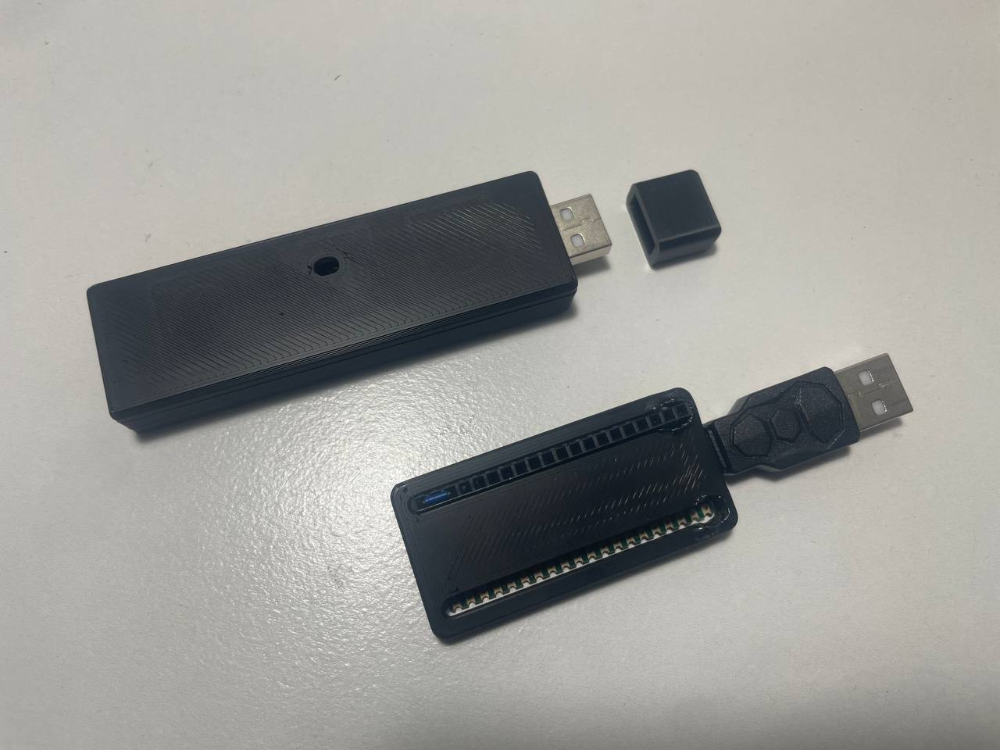

# RubberDucky-RPiPico
A USB Rubber Ducky project using Raspberry Pi Pico that emulates keystroke injection for automation and penetration testing.

**BadUSB** is a type of cyberattack that leverages the flexibility of USB devices to perform malicious actions when plugged into a target system. Instead of acting like traditional storage, a BadUSB device reprograms its firmware to behave like a **Human Interface Device (HID)** — such as a keyboard or mouse — and executes keystrokes automatically.

This technique can:
- Inject malicious commands rapidly
- Download and execute payloads (e.g., PowerShell scripts)
- Create backdoors or exfiltrate data
- Bypass traditional antivirus or endpoint security tools

### 🧠 How Does It Work?

1. **Reprogramming the USB device**  
   Devices like the Raspberry Pi Pico, Digispark, or original Rubber Ducky are programmed to emulate a keyboard.

2. **Payload delivery**  
   The attacker writes scripts (e.g., DuckyScript or Python HID scripts) that contain automated keystrokes. These scripts can open terminals, download malware, create admin users, etc.

3. **Execution**  
   When plugged in, the system sees the USB device as a keyboard and automatically trusts it. The payload executes immediately without needing physical interaction.

4. **Outcome**  
   Within seconds, the device may:
   - Open PowerShell
   - Disable Windows Defender
   - Download remote tools
   - Install backdoors or collect info

## ⚠️ Important:
BadUSB attacks are very powerful and dangerous. This project is for educational and authorized testing purposes only. Always get permission before using such tools in real environments.

## 💻 Requirements
<table>
  <tr>
    <td align="center">
      <strong>Raspberry Pi Pico</strong><br>RM11.88<br>
      
    </td>
    <td align="center">
      <strong>USB M to Micro USB M Adapter</strong><br>RM3.39<br>
      
    </td>
    <td align="center">
      <strong>Jumper Wires</strong><br>(for mode/payload selection)<br>
      <!-- No image for this item -->
    </td>
  </tr>
</table>

## 📂 Project Structure
- `Payloads/` - DuckyScript-style scripts
- `Scripts/` - Python code to run on the Pico
- `lib/` - Required CircuitPython libraries (HID, asyncio, etc.)
- `Casing 3D Print/` - STL files for 3D-printed case (if applicable)

## 🧰 Setup / Installation

1. Download `adafruit-circuitpython-raspberry_pi_pico-en_US-9.2.8.uf2` from [CircuitPython Downloads](https://circuitpython.org/board/raspberry_pi_pico/).
2. Plug in the Pico via USB.
3. It will appear as a USB storage device named `RPI-RP2`.
4. Drag and drop the `.uf2` file onto the RPI-RP2 drive.
5. The Pico will reboot and reappear as `CIRCUITPY`.
6. Download the **Adafruit HID library bundle**: `adafruit-circuitpython-bundle-9.x-mpy-20250711.zip`
7. Extract the `.zip` file.
8. From the extracted folder:
   - Copy `adafruit_hid`, `asyncio`, and `adafruit_wsgi` folders into the `CIRCUITPY/lib/` directory.
   - Also copy `adafruit_debouncer.mpy` and `adafruit_ticks.mpy` into the same `lib/` directory.
9. Delete the default `code.py` in `CIRCUITPY`.
10. Download the script files from this GitHub repo under `Scripts/`:
    - `code.py`
    - `boot.py`
    - `duckyinpython.py`
    - `webapp.py`
    - `wsgiserver.py`
11. Find pre-made payloads at [Hak5 Rubber Ducky Payloads](https://github.com/hak5/usbrubberducky-payloads) or write your own.
12. Rename your desired payload to `payload.dd` and place it in the root of the CIRCUITPY drive.

## 🛠️ How to Use

By default, if a `payload.dd` file is present in the CIRCUITPY root, the Rubber Ducky script will run automatically when the device is plugged in.  
⚠️ To prevent the script from executing on your own machine, enter **Setup Mode** first.

### 🛡️ Entering Setup Mode

To safely edit the payload without running it:
- Connect **GPIO 1** (pin 2) to **GND** using a jumper wire.
- This tells the device to skip running the payload and enter setup mode.

**Setup Mode:**



While in setup mode, you can:
- Edit or replace the `payload.dd` file.
- Modify or update any scripts on the device.

Once editing is complete:
- **Unplug the device**
- **Remove the jumper wire**
- Plug the device into a **target machine** — it will now execute the payload.

### 📦 Storing & Selecting Multiple Payloads (testing/dev)

If you're still developing or testing and want to store up to four payloads on a single Pico, you can add multiple .dd files and select which one to run by grounding a corresponding GPIO pin.

**GPIO → payload mapping**
Place these files in the root of the CIRCUITPY drive, and ground the listed GPIO pin to tell the script which payload to run:
- payload.dd → GP4
- payload2.dd → GP5
- payload3.dd → GP10
- payload4.dd → GP11

### 🔒 Final product: hide CIRCUITPY (no USB storage)

When you’re finished developing and want the Pico to present only as an HID (so it won’t show up as a USB storage drive on the host), ground the dedicated GP15 pin  to disable the CIRCUITPY mass storage device at boot, so that the device will not enumerate as a USB storage on your target computer.


---

### 📄 Payloads

You can find example payloads from:
- 🔗 [Hak5 Official Payload Repo](https://github.com/hak5/usbrubberducky-payloads)
- Or search any Rubber Ducky Payloads on GitHub for more community-created scripts
- 📁 `Payloads/` folder in this repository

Once you're confident, you can build your own custom payloads using basic **DuckyScript** commands:

| Command             | Description         |
|---------------------|---------------------|
| `STRING`            | Types the following text |
| `DELAY`             | Waits for a given time (in milliseconds) |
| `GUI R`             | Presses Win + R (Run) |
| `SPACE`             | Presses the spacebar |
| `ENTER`             | Presses Enter/Return |
| `TAB`               | Presses the Tab key |
| `CTRL SHIFT ENTER`  | Press to run as admin |
| `ALT F4`            | Close Window |
| `LEFTARROW`         | Presses the left arrow key |

> Example:
> ```
> GUI R  
> DELAY 500  
> STRING notepad  
> ENTER  
> STRING Hello from Rubber Ducky  
> ```

## 🔒 Disclaimer
For educational and authorized testing purposes only.
