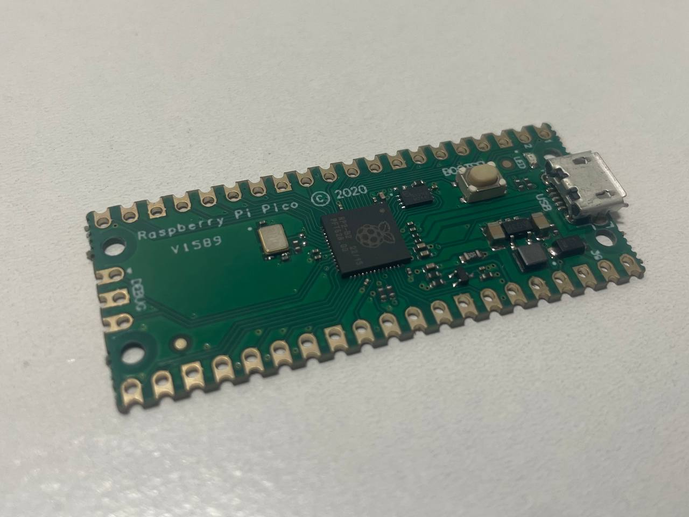
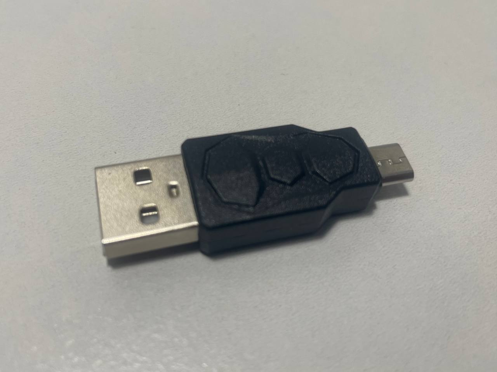

# RubberDucky-RPiPico
A USB Rubber Ducky project using Raspberry Pi Pico that emulates keystroke injection for automation and penetration testing.

💻 Requirements
- Raspberry Pi Pico

*Raspberry Pi Pico board used for the project*
- MicroPython or CircuitPython
- USB M to Micro USM M Adapter

## 📂 Project Structure
- `payloads/` - DuckyScript-style scripts
- `scripts/` - Python code to run on the Pico
- `docs/` - Additional documentation

## 📸 Screenshots
(Add screenshots here)

## 🛠️ How to Use
(To be filled in after project is done)

## 🔒 Disclaimer
For educational and authorized testing purposes only.
